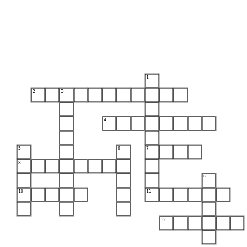

**по-горизонталі:**

2  процес обробки даних

4  всесвітня комп'ютерна мережа

7 раніше - коробка з перфокартами

8 мережа в одному будинку

10 програми

11 буква чи знак

12 буває Комп'ютерна

**по-вертикалі:**

1 через нього людина взаємодіє з комп'ютером

3 процес обробки даних

5 ключове

6 там файли

9 прилад для переведення сигналів
