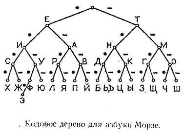

**Поняття про симовли та їх кодування** (параграф 5)

 Як ти розумієш, що таке символ?
**Символ** - це знак, який щось позначає та має сенс.

 Як ти розумієш, що таке кодування повідомлень?
**Кодування** - процесс **перетворення** повідомлення в зрозумілу для одержувача форму або у форму, зручну для передачі за допомогою іншої послідовності знаків

Поки що зупинимось на кодуванні текстових повідомленнь

Способи :
- Азбука Морзе
- Кодування шрифтами Брайля
- Жести
- Двійкове кодування

**Декодування** - процесс перетворення закодованого повідомлення у форму зрозумілу для отримувача. Для цього нам знадобиться таблиця кодування. 

Наведіть приклади символів

Поясніть навіщо потрібно кодувати повідомлення

П 6

Практична: Закодувати та декодувати повідомлення (Літера -> її порядковий номер у алфавіті) **стор. 29**