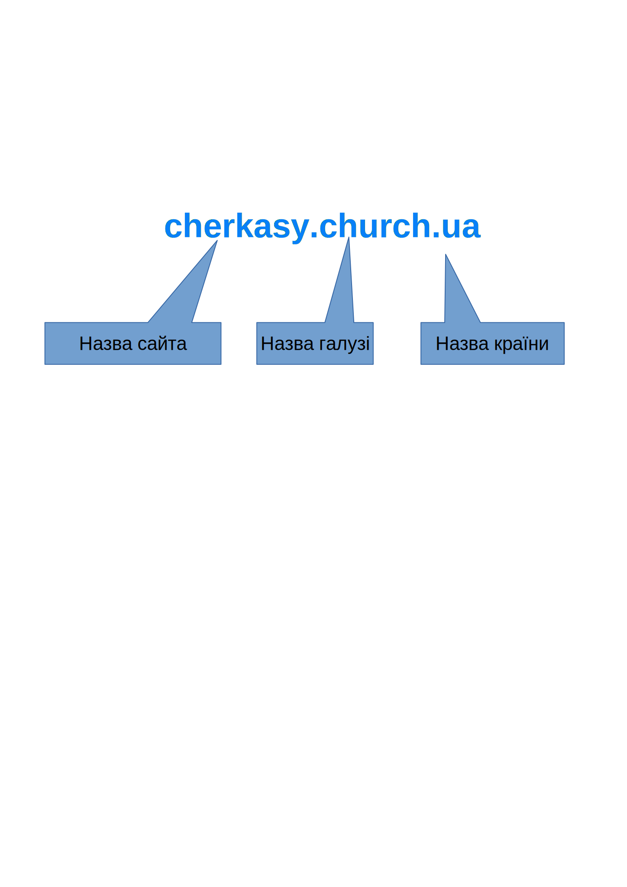

# 13. Веб-сторінки та гіперпосилання.

## Перевірка ДЗ
*звернути увагу на вправу 7, стор. 66*

На уроці дізнаємось як схематично можно відобразити мережу, що таке веб-сер

вери, Сайт, Веб-сторінка, Гіперпосилання, всесвітнє павутиння.

Працюємо:
- Дивимось веб-сторінку (можливо її код) [наприклад](./../../ekzamen/index.html)
- Пригадуємо що означають літери www
- 

