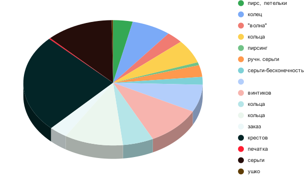
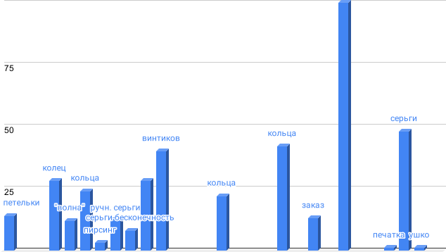

## Урок 3
Тема уроку: Схеми, діаграми на матеріалі інших предметів.
 
**Мета уроку**: 
 
Навчальна: сформувати свідомі знання з даної теми, закріпити правила поведінки в школі, навчити створювати діаграми та схеми на основі поданих даних;
Розвивальна: розвивати мислительні процеси дітей та моторику рук, сприяти всебічному розвитку;
Виховна: виховувати інтерес до вивчення інформатики.
Тип уроку: засвоєння нових знань, формування вмінь.
Обладнання та наочність: комп’ютери, підручники «Природознавство 4 клас», презентація, проектор.
Програмне забезпечення: MS Office, MS Power Paint.

*Повторення правил поведінки в комп’ютерному класі;*

**Для чого потрібні мітки на карті?**
**Як створити власну карту за допомогою онлайн сервісу Карти Google?**
**Як додати мітку до власної карти?**

Учитель. На сьогоднішньому уроці ми будеме говорити про те, **яким чином можна подати текстову та числову інформацію.**

**Вивчення нового матеріалу.**
В сучасному житті ми отримуємо багато інформації. Ми чуємо, бачимо, відчуваємо. Деякі краще сприймають інформацію на слух, деякі – побачивши чи прочитавши. Є випадки, коли потрібно швидко засвоїти багато інформації, або представити купу інформації іншій людині. І зробити це потрібно швидко, просто та доступно. І тут на допомогу нам приходить **графіка**. Інформація графічно може подаватися у вигляді:
- Схем;
- Діаграм;
- Карт;
- Планів;
- Графіків.
Далі ми розглянемо кожен пункт більш детальніше.
**Схема** – спрощене зображення,викладення чогось у загальних, основних рисах. **(Запитання до класу: Де використовують схеми? Де використовуєте схеми саме Ви?)**

**Діаграма** — графічне зображення, що наочно у вигляді певних фігур показує співвідношення між різними величинами, які порівнюються. 
Діаграми бувають таких видів: **секторна, стовпчаста, лінійна, гістограма, кругова, з областями, кільцева** та ін.
**(Запитання до класу: Де використовують діаграми? Де використовуєте діаграми саме Ви?)**

**Графік** – це один із видів діаграми. Це наочне зображення кількісної залежності різних явищ, процесів, тощо.
**(Запитання до класу: Де використовують графіки? Де використовуєте графіки саме Ви?)**

**План** – горизонтальний розріз або вид згори будь-якої споруди чи предмета.
**(Запитання до класу: Де використовують плани? Чи зустрічалися з планами в своєму житті?)**

**Карта** - зменшене зображення певної території земної поверхні на площині.
**(Запитання до класу: Де використовують карти? Чи зустрічалися з картами в своєму житті? Навіщо їх використовувати?**)

**Підсумок уроку.**
 Що цікавого ви сьогодні дізналися на уроці?
 Що найбільше сподобалося?
 Що запам’яталося?
 Про що хотіли би дізнатися більше?
 Що таке діаграма?
 Навіщо використовують діаграми?
Які бувають види діаграм?
 Що таке схема?

[Источник](https://naurok.com.ua/urok-4-rozrobka-uroku-dlya-4-klasu-z-temi-grafika-shemi-diagrami-na-materiali-inshih-predmetiv-6056.html)

**Приклад секторної діаграми**

**Приклад стовпчастої діаграми**

