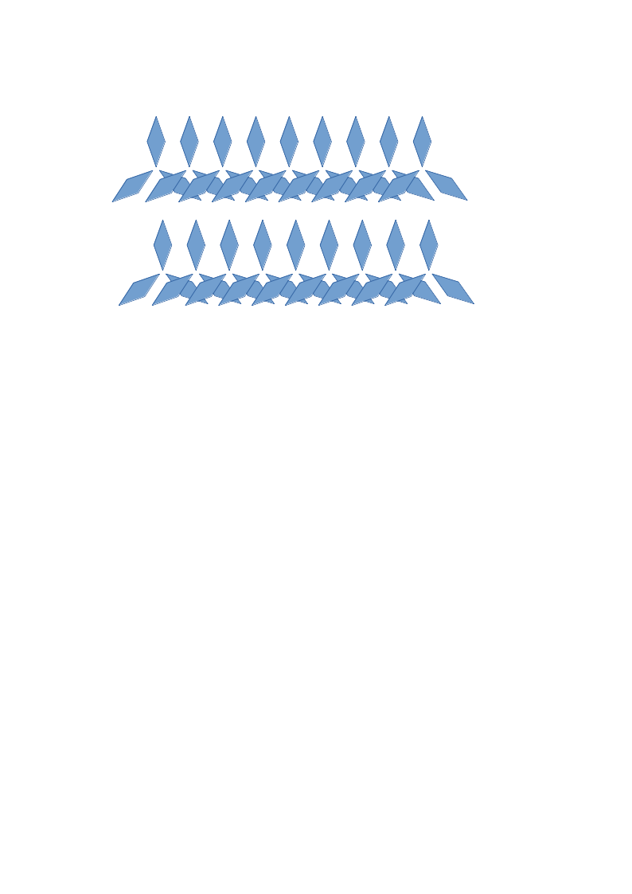

# Графічний редактор. Libre Office Draw.

**Перевірка ДЗ**
1. Хто спробував щось створити у ГР?
2. Які питання виникли при роботі з ГР?
3. Чи хтось зможе надіслати на імейл свої роботи?
4. Як справи з LeoCAD?

Робота з комп'ютером:
- У ГР створити примітиви
- Створити орнамент за допомогою інструментів трансформації та "дзеркала"
- Розібрати можливі алгоритми для створення орнаменту
- Розглянути можливості конвертації та експорту зображень

--ДЗ--: стор. 71, завд. 1, 2