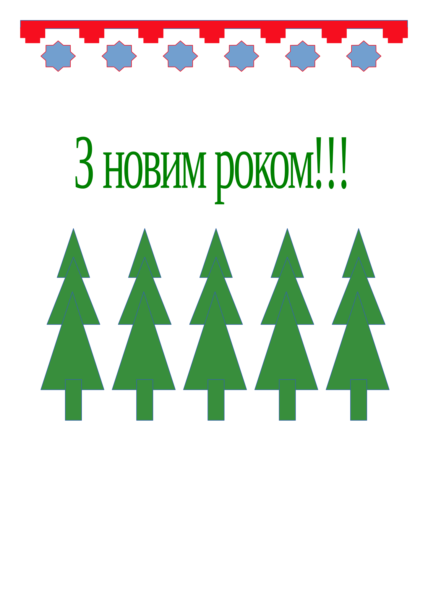

# Продовження теми граф. редакторів, а саме Libre Office Draw

- Вчимося робити написи на малюнках
- Обираємо шрифт та його розмір
- Знайомимось з графічними ефектами написів

Звернути увагу на практичні завдання, та поступово перейти до нової великої теми, а саме
## Безпека дітей в Інтернеті

- Повторимо, ви вдома теж пригадайте тему "пошук даних в Інтернеті"
- Що називають Інтернетом
- Браузер
- Комп. вірус
- Антивірус
стор. 82 питання та завдання