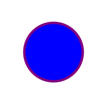

# Поняття комп’ютерної графіки

Column: 6 класс
Created: September 8, 2021 7:41 PM
Lesson Date: September 10, 2021
Status: Not Started
Type: Lesson

**Безпека життєдіяльності при роботі з комп'ютером.** 

**Поняття комп’ютерної графіки**

**Растрові та векторні зображення, їхні властивості.** 

**Формати файлів растрових і векторних зображень.** 

**растровые**  jpeg png img gif 

**векторные** svg

**Налаштування параметрів та перетворення формату готового зображення.**

**Растровая графика.** Известно, что на компьютере изображения представляются в цифровом виде. Цифровое – значит, описано посредством чисел. Это позволяет хранить, просматривать и обрабатывать изображение в графических редакторах. 
Принцип формирования изображения в растровом и векторных редакторах кардинально отличаются друг от друга.
В растровом редакторе (Gimp, Adobe Photoshop, Paint) изображение разбивается на квадратные элементы одинакового размера и каждый такой элемент описывается отдельно. Этот квадратный графический элемент называют пикселом (picture element, pixel).
Пиксель – наименьшая составляющая растровой графики. Один пиксель содержит в себе информацию о расположении по оси Х и Y, а так же информацию о цвете и прозрачности (альфа-канал).
Изображения, представленные посредством пикселей, называют растровыми, то есть разложенные на элементы.

Растровое изображение — это файл данных или структура, представляющая собой сетку пикселей на компьютерном мониторе или цветовых точек на бумаге и материалах. 

Важными характеристиками для таких изображений являются:
Количество пикселов - разрешение. Они могут указываться отдельно по ширине и высоте (640х480; 1024х768), но иногда указывается общее количество пикселов. ~~Цветовое пространство (цветовая модель) RGB, CMYK, HSV  и т.д. Количество используемых цветов или глубина цвета (эти характеристики имеют следующую зависимость: N = 2I, где N - количество цветов, а I - глубина цвета)~~ 

**Разрешение** - определяет количество единичных элементов растровой карты, приходящихся на единицу длины изображения.Наиболее распространенная единица измерения – dpi – количество пикселов на одном дюйме длины (1 дюйм = 2,54 см).
Но что дает разрешение?
1 дюйм практически совпадает с 5ю клетками в тетради и если обвести их и закрасить одну клетку, то разрешение нашего «рисунка» будет 5 dpi.
Теперь уменьшим размер клетки-пикселя в 4 раза, закрасим только четверть клетки, в этом случае разрешение увеличится только в 2 раза, ведь на одну длину теперь приходится 10 клеток-пикселей 

Теперь видно, что чем выше разрешение, тем точнее будет воспроизведено изображение, его цветовые переходы и оттенки, ну соответственно, чем больше разрешение, тем больше размер файла.

Глубина цвета  -  набор цветов, используемый для отображения изображения.
двухцветные – 1 бит на пиксель. Как правило, это черно-белые изображения;
полутоновые – 1 байт на пиксель (256 градаций). Это градации серого или другого цвета;

цветные:High Color – 16 бит на пиксель (65 536 цветов);True Color – 24 бит на пиксель (16,7 млн цветов); Deep Color – 32 (4 байт отвечает за прозрачность, или информацию об альфа-канале), 48 и более бит на пиксель;

 16 бит на пиксель	24 бита на пиксель	 32 бита на пиксель **Преимущества** растрового изображения:
Распространенность. Растровая графика используется почти повсеместно. Растровое представление изображения понятно многим устройствам ввода-вывода графической информации (мониторы, принтеры, фотоаппараты, сканеры) С помощью этой графики возможно создание практически любого рисунка, вне зависимости от сложности (в векторной графике это получается далеко не всегда) Высокая скорость обработки изображения   

 **Недостатки:**Изображение нельзя произвольно масштабировать (без потери качества), так как при уменьшении возможно выпадение отдельных рядов пикселей, а увеличение приводит только к увеличению размеров пикселей.Большой размер файлов с простыми изображениями

Векторная графика – это изображения, сформированные из простейших геометрических образов (точек, линий). Для описания изображения используется только математическая интерпретация. Качество векторной визуализации обуславливается точностью вывода (требуются устройства, поддерживающие векторную визуализацию: графопостроители или векторные дисплеи) и номенклатурой поддерживаемых базовых графических примитивов (линий, дуг, кривых, эллипсов).

Если основным элементом растровой графики является пиксель (точка), то в случае векторной графики основным базовым понятием является – линия. Для её математического представления используются:
а) точка – кривая 0-го порядка
б) линия – кривая 1-го порядка
в) эллипс – кривая 2-го порядка
г) кривая Безье – параметрическая кривая

Каждый элемент обладает следующими характеристиками:
параметры уравнения: цвет заполнения цвет контура оформление контура

**Преимущества** векторных изображений:
удобство масштабирования (без потери качества), с возможностью проработки на одном изображении элементов с сильно различающимися размерами;форма, пространственное положение и цвет объектов описывается с помощью математических формул. Это обеспечивает сравнительно небольшие размеры файлов изображений и независимость от разрешения печатающего устройства или монитора; 

**Недостатки:**
для воспроизведения векторного изображения обычно необходимо достаточно сложное программное обеспечение, понимающее и корректно исполняющее весь нетривиальный протокол рисующих команд, записанных в файле векторного графического формата;сложность расчетов для большого количества объектов в изображении. При этом чем сложнее изображение - тем более длинным является соответствующий файл и тем дольше это изображение прорисовывается;

Источник: https://sites.google.com/site/plttcompgraf/lectures

<a  href="javascript:;" onclick="window.open(webspace.printUrl)">Печать страницы</a>