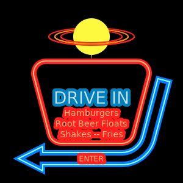

# Векторний графічний редактор. [Inkscape](https://inkscape.org/ru/).

- Він є свободним ПЗ, Inkscape является свободным ПО с открытым исходным кодом, лицензия предоставляется в соответствии с GPL.
- для создания иллюстраций, иконок, логотипов, диаграмм, карт, а также веб-графики. Inkscape использует открытый стандарт SVG (Scalable Vector Graphics)

