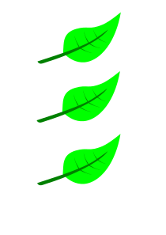

# Створення векторного зображення

**Перевірка ДЗ**
1. Які питання виникли
2. Чи намалював хто-небудь жабку за алгоритмом. Давайте пригадаємо завдання та ваші дії (стор. 27, мал. 34) 

## Криві Безьє 
істор. [довідка](https://ru.wikipedia.org/wiki/%D0%9A%D1%80%D0%B8%D0%B2%D0%B0%D1%8F_%D0%91%D0%B5%D0%B7%D1%8C%D0%B5): Кривы́е Безье́ — типы кривых, предложенные в 60-х годах XX века независимо друг от друга Пьером Безье из автомобилестроительной компании «Рено» и Полем де Кастельжо из компании «Ситроен», где применялись для проектирования кузовов автомобилей.
Несмотря на то, что открытие де Кастельжо было сделано несколько ранее Безье (1959), его исследования не публиковались и скрывались компанией как производственная тайна до конца 1960-х.

стор. 31, Робимо зображення листка (мал. 39-41)
Спробуйте змінити лист на жовтий, з градієнтною заливкою.
Зробити мітку для карти.

 