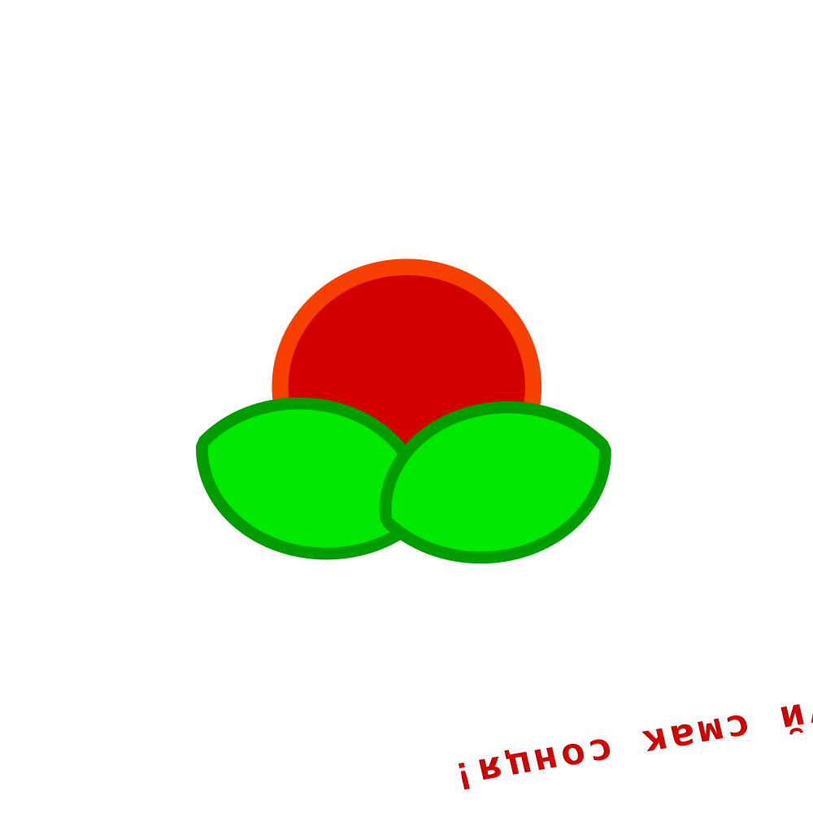

# 1.6 Додавання тексту до зображень

## перевірка ДЗ стор. 41

Сьогодні розглянемо процедуру додавання тексту до зображень в різних редакторах.
Inkscape.
стор. 44 увага,

## ДЗ на канікулах створити логотип

